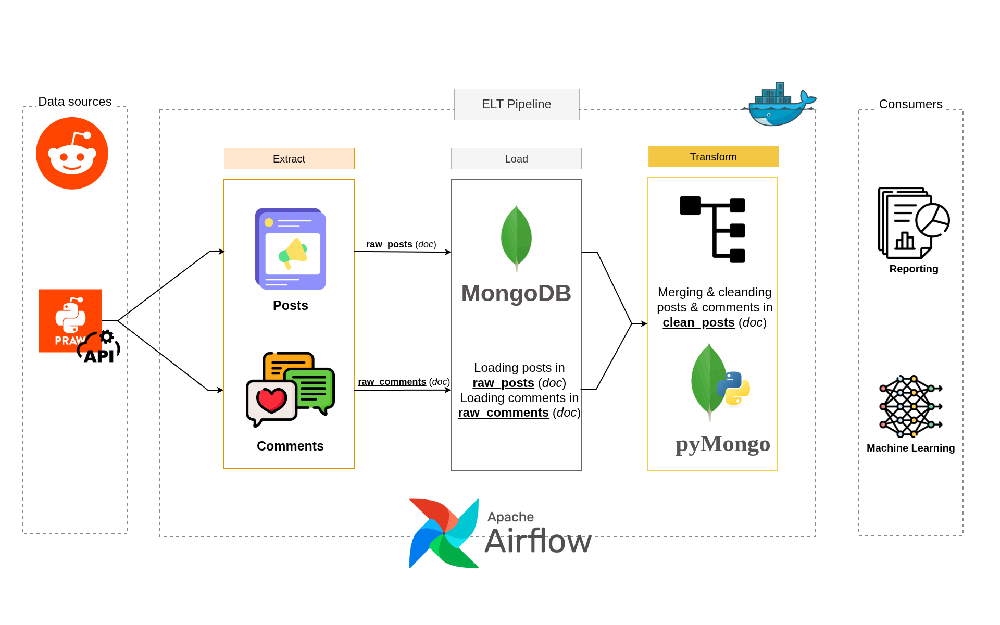

# Reddit ELT Pipeline

## Overview
this project is end-to-end **ELT Pipeline** that extract data from reddit top Egyptian subreddits and store it doing some some cleaning and transfrom it to be easier to work with

## Project structure
```.
├── airflow.env
├── dags
│   └── reddit_dag.py      # DAG definition for the Reddit pipeline
├── docker-compose.yml     # Docker services configuration
├── Dockerfile             # Custom Airflow image build file
├── elts
│   └── reddit_elt.py      # Extract, Load, and Transform funcitons
├── pipelines
│   └── reddit_pipeline.py # Connects ELT with Airflow DAG
├── requirements.txt
├── utils
|    ├── connections.py     # Connect to APIs and DataBases
|    └── constants.py
└──  work_flow_diagram.png
```
## Technologies Used
* **Python 3.12.3** *for scription*
* **Apache Airflow 2.7.1** *for Orchestration*
* **MongoDB 6** *To Load data*
* **PRAW** *To use Reddi API*
* **Docker & Docker Compose** *for Infrastructure*

## Work Flow


### 1. Smart Extraction
#### Unlike traditional scrapers, this pipeline uses a State-Driven extraction logic:

* **Post Extraction:** Fetches top daily posts from subreddits like `r/Egypt`, `r/CAIRO`, and `r/Masr`.

* **Smart Sync:** It queries MongoDB to identify "Active Posts" (posts created within the last 30 days). It only fetches new comments if the post hasn't been synced in the last 24 hours, optimizing API rate limits.


### 2. Scalable Loading

* **Atomic Upserts:** Uses MongoDB `UpdateOne` with `upsert=True` to prevent duplicate records and update existing post scores.

* **Data Lineage:** Every record is timestamped with `ingested_at` and `last_sync_utc` to track data freshness and audit the pipeline.

### 3. Aggregation & Transformation
#### The transformation layer is executed directly within the database engine for maximum performance:
* **Merging**: Joins posts and comments into a unified `processed_reddit_data` collection.

* **Optimization**: A specialized pipeline unsets **20+ redundant metadata** fields and filters out `null` values, significantly reducing the storage footprint and improving query speed for BI tools.
##  How to Run

#### Step 1: Environment Setup
Configure your `/config/config.conf 
` file with your Reddit API and Mongo credentials:
```
[mongodb]
mongo_uri = mongodb://mongodb:27017
mongo_db = reddit_db
raw_collection = raw_posts
clean_collection = clean_posts

[api_keys]
reddit_secret_key = <your secret key>
reddit_client_id = <your clieng id>
user_agent = <your user agent>
```
#### Step 2: Create Virtual Environment & Install Dependencies
This step is useful for local development, testing, or understanding dependencies
before running the pipeline using Docker.
```
python3 -m venv venv
source venv/bin/activate
pip install --upgrade pip
pip install -r requirements.txt
````

#### Step 3: Container Orchestration
Run the following command to build the custom Airflow image (optimized with Layer Caching) and start all services:

```
docker-compose up -d --build
```

#### Step 4: Pipeline Monitoring

* Access the Airflow Webserver at [Airflow UI](http://localhost:8080).

* Login with: 
```
username: airflow
password: airflow
```

* Enable the `reddit_pipeline_dag` to trigger the first run.

## Database Structure
* **Raw Layer:** `raw_posts`, `raw_comments` (Minimal processing).

* **Analytical Layer:** `final_analytics` (Cleaned, Merged, and Optimized for queries).

## Note ⚠️
If you want to test something and delete `MongDB` sync from `Shell` or `Compass` Do: 
```
db.raw_posts.updateMany({}, { $unset: { last_comments_sync_utc: "" } })
```
